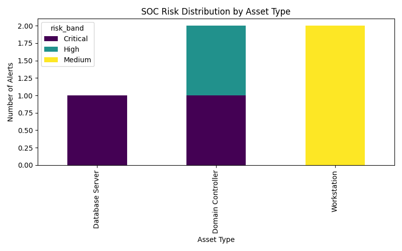

# Risk-Based SOC Alert Scoring System



## Overview
This project implements a **risk-based alert scoring system** for Security Operations Centers (SOC). It calculates risk scores for security alerts based on **asset criticality, alert severity, and user roles**, and visualizes them for easy analysis.

The system helps SOC teams **prioritize alerts efficiently** and reduce response times for critical threats.

---

## Features
- Calculates **risk scores** for alerts using multiple factors.
- Assigns **risk bands**: High, Medium, Low.
- Filters alerts by **department, asset type, or user role**.
- Generates **visual dashboards** for alert risk distribution.
- Exports **risk-scored alerts to CSV** for reporting and analysis.

---

## Tech Stack
- **Python 3.11+**  
- **Pandas** – Data processing  
- **Matplotlib** – Data visualization  
- **CSV** – Input and output files  

---

## Input Files
- `alerts.csv` – Security alerts with timestamp, type, confidence, asset, and user info  
- `assets.csv` – Asset details including criticality  
- `users.csv` – User information including roles and privileges  
- `historical_fp.csv` – Historical false positive data  

---

## Installation
1. Clone the repository:
   ```bash
   git clone https://github.com/Yash1Trillion/risk-based-soc-project.git
   cd risk-based-soc-project
